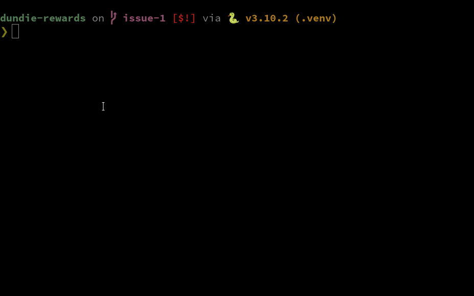

# Projeto Dundie Rewards

[](https://github.com/AyslanBatista/dundie-rewards/actions/workflows/main.yml)

Nós fomos contratados pela Dunder Mifflin, grande fabricante de papéis para desenvolver um sistema
de recompensas para seus colaboradores.

Michael, o gerente da empresa quer aumentar a motivação dos funcionários oferecendo um sistema
de pontos que os funcionários podem acumular de acordo com as suas metas atingidas, bonus oferecidos
pelo gerente e os funcionários podem também trocam pontos entre sí.

O funcionário pode uma vez a cada ano resgatar seus pontos em um cartão de crédito para gastar onde
quiserem.

Acordamos em contrato que o MVP (Minimum Viable Product) será uma versão para ser executada no terminal
e que no futuro terá também as interfaces UI, web e API.

Os dados dos funcionários atuais serão fornecidos em um arquivo que pode ser no formato .csv ou .json
e este mesmo arquivo poderá ser usado para versões futuras. `Nome, Depto, Cargo, Email`


## Installation

```py
pip install seunome-dundie
```

```py
pip install -e `.[dev]`
```

## Login
- Exporting variables

```bash
export DUNDIE_USER=email
export DUNDIE_PASSWORD=password
```
#### OR

- Entering your user and password when running a command

```bash
dundie show
```
```bash
❌ [ERROR] You need to be logged in to access this function.

Please enter the email and then the password
User: user
Password: password

✅ [AUTHORIZED] You are logged into the account 'user'
```

## Usage

```py
dundie --help
```


